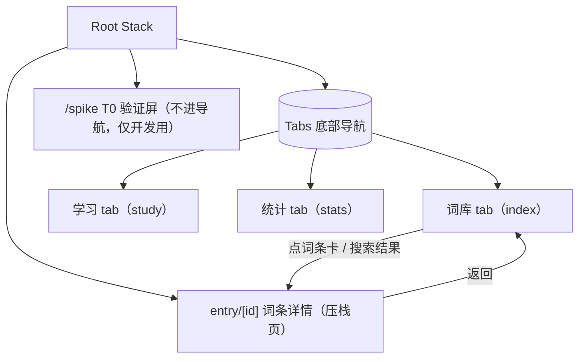
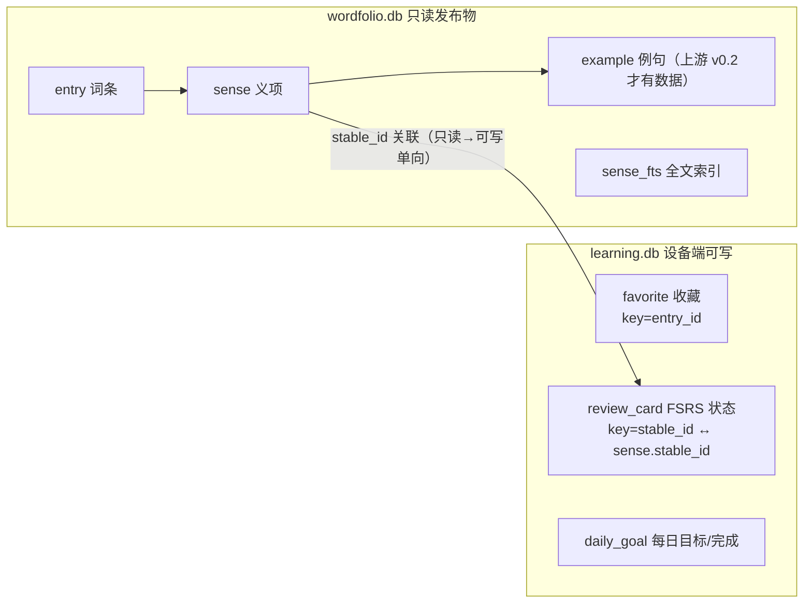

# Wordfolio 移动端功能逻辑树

> 目的：内测反馈「功能间的逻辑不清楚」。本文是全 app 的功能地图——每一屏是什么、
> 数据从哪来到哪去、功能之间如何衔接、未来功能加在哪里。**新功能必须先在 §5 找到槽位再动手。**
> 随代码演进维护；大改在 commit message 里引用本文的章节号。

更新：2026-10-03 ｜ 对应版本：beta.4

## 1. 信息架构（导航树）



- **三个 tab = 三条独立的用户意图**：找词（词库）、学词（学习）、看进展（统计）。
- 词条详情是唯一的压栈页——从词库任何入口（网格卡、搜索结果）进，返回回到原位置。
- spike 屏是 T0 遗留验证页，不出现在任何导航入口，Release 不受影响。

## 2. 三条功能线的职责边界

| 功能线 | 回答的问题 | 包含 | 明确不包含（去哪找） |
|---|---|---|---|
| **词库** | 这个词什么意思？ | 浏览网格、搜索、筛选（全部/收藏/词性）、词条详情、收藏、点读 | 学过的词怎么排期（→学习）；学了多少（→统计） |
| **学习** | 今天背什么？ | 今日队列（复习优先、新卡补足）、翻卡、四键评分、自动补新卡 | 词内容对错（→词库详情核对）；进度趋势（→统计） |
| **统计** | 我学得怎么样？ | 今日进度、连续天数、累计、已稳固、卡片分布、每日目标设置 | 改变调度行为（→学习线 FSRS 参数，M-D 前冻结） |

**衔接点（功能间唯一的合法交互）**：
1. 词库收藏 ⟷ 学习队列：收藏**不会**自动进队列（队列新卡只按词频取），避免用户收藏但从未出现的困惑。
2. 学习评分 ⟷ 统计：评分落 `review_card` + `daily_goal`，统计页只读聚合。
3. 统计改目标 ⟷ 学习队列：次日生效（今日队列不变，见 study.tsx 注释）。

## 3. 数据所有权（两库分离，ADR-0005 D3）



- **关联键是 `sense.stable_id`**（义项级），不是 entry_id——一个词的多个义项各自独立排期。
- 用户状态只进 learning.db；换发布物（edition 升级）不丢学习记录。
- 两库访问全部收口在 `src/db/repository.ts`（读发布物）与 `src/db/study.ts`（读写学习库），UI 不直接写 SQL。

## 4. 关键算法流（改这里前先读）

### 4.1 搜索（词库）
```
输入 query（300ms 防抖）
├─ 含中文 → LIKE 回退（FTS unicode61 不分词中文）
│    └─ 结果按 rank 分层：词头精确 0 > 词头含 1 > 释义命中 2
└─ 纯拉丁
     ├─ <2 字符 → 拒绝，提示「中文可搜单字」（单字母 FTS 前缀会命中 1800+ 条）
     └─ ≥2 字符 → 词头精确/前缀优先（用户找的就是这个词）→ 不足再补 FTS 释义命中
```

### 4.2 今日队列（学习，`fsrs-core.buildTodayQueue` + `queue.spreadByHeadword`）
```
读 review_card 全表
├─ 过滤 isDue（新卡恒到期；其余按 due ≤ now）
├─ 排序：复习卡（越早到期越前）→ 新卡
├─ 按 stable_id 打散同词头义项（a#1,a#2 连排会掩盖「词认识但义项不认识」）
└─ 截断到 daily_goal.target
补新卡：不足目标时按 e.freq_rank 取尚未建卡的义项（每次 ≤ SEED_BATCH=20）
评分：ts-fsrs v5 next(card, now, grade) → 覆盖写 review_card；daily_goal.completed+1
```

### 4.3 已稳固定义（统计）
`state == Review 且 scheduled_days ≥ 21`——即 FSRS 已把间隔排到 3 周以上的义项。阈值是产品决策，不是 FSRS 概念，调它要同步改统计口径与文案。

## 5. 演进槽位（新功能先对号入座）

| 计划功能 | 槽位 | 触碰的文件 | 依赖 |
|---|---|---|---|
| 错题本（评分 Again 的卡回看） | 学习 tab 内二级入口 | study.tsx、study.ts 新表 review_log | 需要先记录逐次评分（现在只存最新状态） |
| 复习历史曲线 | 统计 tab 二级页 | stats.tsx、study.ts | 同上，依赖 review_log |
| 每日推送提醒 | 系统层（expo-notifications），不进 tab | app.json plugin、新 utils/notifications.ts | native 重建，发版时做 |
| 练习题型（听音辨义/义项选择） | 学习 tab 的模式切换（队列同源，出题不同） | study.tsx 拆 组件 | M-C；等上游例句数据（M2-T08） |
| 词书选择（exam_tag） | 词库 tab 顶部入口 + 学习队列过滤 | repository browse 加维度 | M-D；上游有标注数据后 |
| OTA 更新 | 发布层（eas update，channel beta） | eas.json 已预留 channel | beta.3+ 已具备 |

**原则**：每个新功能必须能放进上表某一行；放不进去 = 信息架构要改 = 先改本文评审，再写代码。

## 6. 设计语义速查

- **色**：琥珀=主行动/选中/已收藏；蓝=可点文本；绿=完成语义（进度条）；其余中性阶。见 `src/theme/tokens.ts` 头注。
- **字**：屏标题 26/800；卡标题 15–17/700；正文 13–14；辅助 12 muted。
- **触控**：可点元素最小高 40（chip）/ 44（目标）/ 48（评分、主按钮）。
- **图标**：Ionicons 线性，集中 `src/components/icons.tsx`，不使用 emoji。
