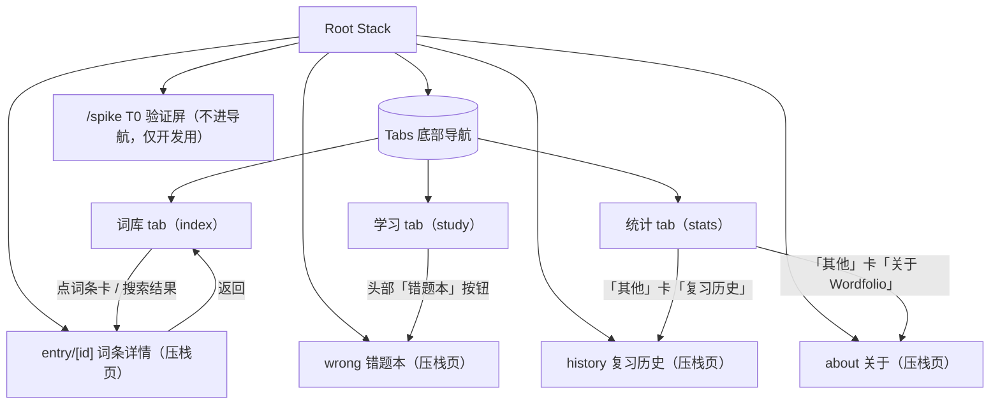
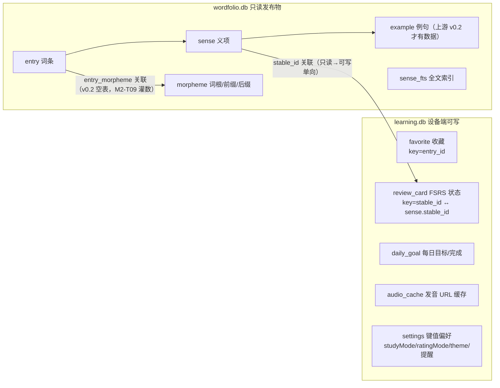

# Wordfolio 移动端功能逻辑树

> 目的：内测反馈「功能间的逻辑不清楚」。本文是全 app 的功能地图——每一屏是什么、
> 数据从哪来到哪去、功能之间如何衔接、未来功能加在哪里。**新功能必须先在 §6 找到槽位再动手。**
> 随代码演进维护；大改在 commit message 里引用本文的章节号。

更新：2026-10-05 ｜ 对应版本：beta.21（M-G 体验打磨：统计页聚焦刷新 / 复习历史周月聚合 / M-F 复核遗留清偿）

## 1. 信息架构（导航树）



- **三个 tab = 三条独立的用户意图**：找词（词库）、学词（学习）、看进展（统计）。
- 词条详情是唯一的压栈页——从词库任何入口（网格卡、搜索结果）进，返回回到原位置。
- 复习历史是统计 tab 的二级压栈页（近 30 日柱状，日/周/月三段切换 + 逐次明细），返回回到统计。
- spike 屏是 T0 遗留验证页，不出现在任何导航入口，Release 不受影响。

## 2. 三条功能线的职责边界

| 功能线 | 回答的问题 | 包含 | 明确不包含（去哪找） |
|---|---|---|---|
| **词库** | 这个词什么意思？ | 浏览网格、搜索、筛选（全部/收藏/词性）、词条详情、收藏、真人发音 | 学过的词怎么排期（→学习）；学了多少（→统计） |
| **学习** | 今天背什么？ | 今日队列（复习优先、新卡补足）、四种模式：卡片（翻卡+评分键，三档自评默认 / 专家模式四键，见 §5.5）/ 练习（看词选义）/ 听音（听音辨义）/ 拼写（听写产出）、自动补新卡、词头发音 | 词内容对错（→词库详情核对）；进度趋势（→统计）；练习/听音/拼写的 FSRS 评分键（自由练习自动 Good/Again 计分） |
| **统计** | 我学得怎么样？ | 今日进度、连续天数/最长连续、累计、自由练习次数、已稳固、卡片分布、未来复习压力预测（§5.6）、学习热力图（§5.6）、每日目标设置、设置区（目标/提醒/外观/评分模式） | 改变调度行为（→学习线 FSRS 参数，M-D 前冻结） |

**衔接点（功能间唯一的合法交互）**：
1. 词库收藏 ⟷ 学习队列：收藏**不会**自动进队列（队列新卡只按词频取），避免用户收藏但从未出现的困惑。
2. 学习评分 ⟷ 统计：卡片模式评分落 `review_card` + `review_log(kind='review')` + `daily_goal`；自由练习只写 `review_log(kind='practice')`——不占今日进度、不动排期。
3. 统计改目标 ⟷ 学习队列：**useFocusEffect 聚焦即重建**（切到学习 tab 立即按新目标组队，今日已完成数保留）。

## 3. 数据所有权（两库分离，ADR-0005 D3）



### 3.1 表结构（learning.db，建表语句唯一出处 src/db/study.ts）

| 表 | 键 | 关键列 | 写入方 | 说明 |
|---|---|---|---|---|
| favorite | entry_id | created_at | favorites store | 收藏的是词条级 |
| review_card | stable_id | due/stability/difficulty/reps/lapses/state/last_review | study 屏评分 | 义项级 FSRS 状态，只存最新（无逐次历史） |
| daily_goal | day(YYYY-MM-DD) | target_count/completed_count | 评分、统计页改目标 | 统计页只改 target；completed 由评分推进 |
| audio_cache | word | url/fetched_at | 发音链预取/首播时 | 同词二次播放零联网；URL 失效靠播放失败回退 TTS 自愈 |
| review_log | id 自增（stable_id 索引） | rating(1-4)/due_after/reviewed_at | study 屏每次评分 | **逐次**留痕；review_card 只存最新。错题本与复习曲线的唯一数据源 |
| settings | key | value（字符串） | 学习模式/评分模式/主题/提醒各自读写 | 键值偏好表（E1 起在用）：studyMode、ratingMode（'simple'\|'expert'，默认 'simple'）、theme、每日提醒配置；备份导出/导入全量按 key 合并 |

### 3.2 状态管理（zustand）

- `useFavorites`：内存 `Set<entry_id>` 乐观更新 + 异步落库；`hydrate()` 只执行一次（`hydrated` 标记），词库/详情/统计三处共享。
- 学习队列**不进 store**：屏内 useState，评分即落库，离开屏即丢弃（下次进屏重建——FSRS 状态在库里，重建无损）。

## 4. 屏级规格（状态 × 行为矩阵）

每屏一行：进入方式 / 数据读写 / 五态表现。空态文案是产品决策，改前对齐本表。

| 屏 | 进入 | 读 | 写 | loading | empty | error | 特殊 |
|---|---|---|---|---|---|---|---|
| 词库 | 首个 tab | browseEntries / searchSenses / favorite ids | favorite 增删 | 列表 spinner | 「没有词条」/「还没有收藏…」/「没有匹配的义项」 | 顶部红字 + 空列表 | 单字母拒搜给提示；搜索 300ms 防抖；清空按钮 |
| 词条详情 | 词库任意卡 | getEntryDetail（含 morphemes 关联查询）/ favorite ids | favorite | spinner | 「词条不存在」 | 「无效词条 id」/加载错误 + 返回 | 词头按钮走真人发音链（§5.3）；无例句时例句区整体隐藏；无词根词缀数据时该区块整体隐藏（§5.5 F2 语义） |
| 学习 | tab | getReviewCards / getDailyGoal / getSeedSenseIds / getStudySenses / favorite / settings(studyMode, ratingMode) | 评分写 review_card + daily_goal；首播写 audio_cache | 整屏 spinner | 「今天完成了」/「今天没有到期的任务」（区分 completed>0） | 屏内红字（保留已加载内容） | 同词义项打散；不足目标按词频补新卡；useFocusEffect 恢复学习模式与评分模式，评分键随模式渲染三键/四键（§5.5） |
| 统计 | tab | getStudyStats / getDailyGoal / getPracticeTotal / getDueTimes / getReviewLogTimestamps / favorite ids / settings(ratingMode) | setDailyTarget / setSetting(ratingMode) | 首载（stats 为空）屏内 spinner；已有数据聚焦刷新静默完成不闪屏 | 数值全 0 正常展示 | 首载失败错误框；刷新失败不清数据，内容区顶部内联提示「统计刷新失败，以下为上次加载数据」 | useFocusEffect 聚焦即刷新（单一触发，学完卡回页即更新，todayKey 随聚焦重算跨 UTC 午夜口径正确）；改目标次日生效（文案已注明）；未来复习压力与学习热力图见 §5.6；评分模式 Switch 即时写库（聚焦读竞态防护见 §5.5） |

## 5. 关键机制

### 5.1 搜索（词库，`db/search.ts` + `db/repository.ts`）
```
输入 query（300ms 防抖）
├─ 含中文 → LIKE 回退（FTS unicode61 不分词中文）
│    └─ 结果按 rank 分层：词头精确 0 > 词头含 1 > 释义命中 2
└─ 纯拉丁
     ├─ <2 字符 → 拒绝，提示「中文可搜单字」（单字母 FTS 前缀命中 1800+ 条）
     └─ ≥2 字符 → 词头精确/前缀优先（用户找的就是这个词）→ 不足再补 FTS 释义命中
```

### 5.2 今日队列（学习，`study/fsrs-core.ts` + `study/queue.ts`）
```
读 review_card 全表
├─ 过滤 isDue（新卡恒到期；其余按 due ≤ now）
├─ 排序：复习卡（越早到期越前）→ 新卡
├─ 按 stable_id 打散同词头义项（a#1,a#2 连排会掩盖「词认识但义项不认识」）
└─ 截断到 daily_goal.target
补新卡：不足目标时按 e.freq_rank 取尚未建卡的义项（每次 ≤ SEED_BATCH=20）
评分：ts-fsrs v5 next(card, now, grade) → 覆盖写 review_card + 追加 review_log(kind='review')；daily_goal.completed+1
自由练习（练习/听音/拼写）：pickPracticeRound 从已学卡随机抽 10 张 → 答对 Good/答错 Again 只写 review_log(kind='practice')；轮完可再来一轮
错题本：review_log 按 stable_id 取最新一条，rating=1（重来）且非已稳固 → 答对一次自动移出
复习曲线：review_log 按 reviewed_at 分日聚合，bucketHistory 补零成连续 N 天（统计页 7 日；复习历史页 30 日 + 逐次明细，见 /history）
```

### 5.3 真人发音链（`utils/pronunciation.ts` → `utils/wordAudio.ts`，**已配韦氏 Learner's key**）
```
点词头喇叭
├─ audio_cache 命中 → 直接播（零联网）
└─ 未命中
     ├─ EXPO_PUBLIC_MW_API_KEY（已配，本地 .env 注入不入库）→ 韦氏 Learner's API
     │    （media.merriam-webster.com，实测无代理网络可达 HTTP 200 ✓）
     ├─ key 缺失/失败 → Free Dictionary API（免 key；其 media 主机无代理网络不可达）
     └─ 都失败 → TTS 兜底（expo-speech，原链路）
播放：expo-audio createAudioPlayer(url) + 轮询 isLoaded，**4.5s 未就绪即销毁并回退 TTS**
（实测：音频 CDN 在无代理网络不可达时 ExoPlayer 永久 BUFFERING——超时兜底必须）
已知限制：无代理的国内网络大概率拿不到真人音频（media 主机不通），静默降级为 TTS；
现状：韦氏链路用户网络实测可达，真人发音默认可用；离线发音包仍作长期项（挂 §6）
注意：EXPO_PUBLIC_ 前缀变量会打进 bundle，是公开变量不是机密；韦氏免费 key 在 dictionaryapi.com 注册
```

### 5.4 FSRS 参数表（`study/fsrs-core.ts`，M-D 内测数据回收前冻结）

| 参数 | 值 | 理由 |
|---|---|---|
| request_retention | 0.9 | 长期学习标准档；M-D 按遗忘曲线实测调 |
| enable_fuzz | false | 内测期可复现、便于对照排查 |
| enable_short_term | true | 保留短时记忆步进，新卡当天内重复出现 |
| 评分四档 | Again/Hard/Good/Easy | ts-fsrs Grade 全集（Manual 不暴露） |
| 「已稳固」口径 | state=Review 且 scheduled_days≥21 | 产品定义（非 FSRS 概念），改动需同步统计页文案 |

### 5.5 评分模式（学习线 + 统计页设置，F1）

```
偏好：settings 表 key='ratingMode'，值为 'simple'|'expert' 字符串本身（沿用 studyMode 风格），
     默认 'simple'（三档自评）；parseRatingMode 无效值回退 'simple'（rating-core.ts 纯函数）
三档自评：认识→Good / 模糊→Hard / 忘记→Again（SIMPLE_GRADES=[Good,Hard,Again]）
专家模式：认识/简单/模糊/忘记 四键（EXPERT_GRADES=[Good,Easy,Hard,Again]，展示序按需求约定）
入口：统计页「评分模式」Switch 卡（与每日目标/提醒/外观同区），开关即时写库即时生效
恢复：学习屏 useFocusEffect 随 studyMode 一起恢复；统计页自身 useFocusEffect 恢复（防备份导入后不同步），
     且有竞态防护（G3）：写序号 + pending 双闸——每次乐观切换自增序号并置 pending，
     聚焦读 resolve 时若期间发生过切换（序号已变）或仍有在途写（pending）则放弃覆盖本地状态；
     落库失败本次 UI 不回退，下次聚焦读以 DB 真值重新对齐（stats.tsx ratingWriteSeqRef 注释）
FSRS 零改动：rate() 仍走 gradeCard(ts-fsrs next) → 覆盖 review_card + logReview + setDailyGoal，
             两模式共享同一调度；主键高亮 = PRIMARY_GRADE 常量（=Rating.Good，rating-core.ts，
             两模式均含；G3 由魔法数字 3 提取而来，行为零变化）
边界：评分键随模式渲染仅适用于卡片（翻卡）正式学习模式；练习/听音/拼写是自由练习，
     答对 Good / 答错 Again 自动计分，无评分键（QuizCard 语义，见 §5.2）
备份：settings 全量导出/导入按 key 合并，ratingMode 自动随备份往返
```

### 5.6 统计衍生指标（未来复习压力 + 学习热力图，F3/F4）

```
未来复习压力（F3）：
  取数 getDueTimes：review_card 全表 due 时间戳（review_card 本身就是排期表，
  自由练习 kind='practice' 不写 review_card，天然「只统计学习排期卡」），全参数化查询
  纯函数 futureLoad(dueTimes, today)：按 UTC 切日（与 todayKey/bucketHistory 约定一致），
  输出 7/30 天逐日到期量 + 今日基准线
  口径决策：逾期卡（due < 今天）与未学新卡（due=建卡时刻已成过去）都并入今日基准线——
  与 fsrs-core isDue 的「今日队列」语义一致，daily7/daily30 首日桶 = todayCount，
  图与基准线不出现口径分裂；畸形时间戳静默跳过
  UI：7 天单行 / 30 天两行（每行 15 列）柱状，今日列 primary 高亮 + label「今」，
  贯穿基准线用 destructive 色（「压力警戒」语义）
学习热力图（F4）：
  取数 getReviewLogTimestamps：review_log 时间戳，不筛 kind——review 与 practice 都计入
  打卡（§8 打卡语义：凡做了跟学习有关的事就算打卡）
  纯函数 heatmapData(timestamps, today)：近 365 天（含今天）逐日 count/level + 按周分列
  weeks（每列固定 7 格、行序周日→周六、首尾越界补 null，可直接渲染 GitHub 布局）；
  兼容 SQLite「YYYY-MM-DD HH:MM:SS」与 ISO 8601 两种格式，按 UTC 切日，非法时间戳跳过
  色阶：固定阈值 0 / 1–2 / 3–5 / 6–9 / ≥10 五档琥珀 ramp（明暗两套，见 §8），0 次无色槽
  UI：GitHub 式格状，列=周；53 列格宽按 useWindowDimensions 自适应（最小 3px）；
  点格内联显示「YYYY-MM-DD：N 次」，再点取消，无详情页；附「少→多」图例
```

## 6. 演进槽位（新功能先对号入座）

| 计划功能 | 槽位 | 触碰的文件 | 依赖 |
|---|---|---|---|
| ~~错题本~~ | **已交付**（/wrong，学习 tab 头部入口） | — | review_log 已就位 |
| ~~复习历史曲线~~ | **已交付**（统计页近 7 日柱状图） | — | review_log 已就位 |
| ~~复习历史完整曲线（按周/月 + 逐次明细页）~~ | **已交付**（/history 统计 tab 二级页：近 30 日柱状 + 逐次明细「练习」标记；G2 补齐 日/周/月 三段切换——默认日，周=ISO 周聚合、月=自然月聚合，纯函数 aggregateTrend 前端聚合，SQL 零改动、不扩窗口） | app/history.tsx、study/stats-core.ts aggregateTrend、study.ts getRecentReviews、stats.tsx | beta.21 |
| ~~每日推送提醒~~ | **已交付**（统计页「每日提醒」卡，expo-notifications 本地通知；无推送服务器，提醒在设备端调度） | utils/reminders.ts、study.ts settings 表、stats.tsx | beta.11；iOS 侧同代码待恢复分发时验证 |
| ~~义项四选一~~ | **已交付**（学习 tab「卡片/练习」模式切换，队列同源；答对=Good、答错=Again 自动计分） | components/QuizCard.tsx、study/quiz-core.ts、repository.getDistractorSenses | beta.13；干扰项同词性优先 |
| ~~听音辨义~~ | **已交付**（QuizCard `variant='listen'`：藏词头 + 自动播放 + 可重播） | QuizCard.tsx、study.tsx | beta.14；有道发音为其前提 |
| ~~拼写听写~~ | **已交付**（`variant='spell'`：听音后手动拼写，考察产出；`normalizeSpelling` 判分容忍大小写/空格/连字符变体） | quiz-core.ts、QuizCard.tsx、study.tsx 四模式 | beta.15 |
| ~~edition 更新机制展示~~ | **已展示**（关于页：app 版本 + 词库 edition/生成日期/规模 + 离线隐私说明；统计页「其他」卡入口） | app/about.tsx、stats.tsx、_layout.tsx | release.readReleaseMeta 已就位 |
| ~~评分模式切换~~ | **已交付**（统计页「评分模式」Switch：三档自评默认，专家模式翻卡四键；FSRS 调度零改动，仅卡片模式有评分键） | study/rating-core.ts、db/study.ts settings、stats.tsx、study.tsx | beta.20 |
| ~~词根词缀助记~~ | **已交付（数据空表默认隐藏）**（详情页「词根词缀」卡：kind 徽标 + 形态 + 中文释义 + 来源；morpheme/entry_morpheme 空表时整块隐藏，上游 M2-T09 灌数后自动显现） | components/MorphemeCard.tsx、db/morpheme-core.ts、repository.ts、entry/[id].tsx | beta.20；等上游 M2-T09 数据 |
| ~~未来复习压力预测~~ | **已交付**（统计页 7/30 天逐日到期量柱状 + 今日基准线，逾期与新卡并入今日桶） | study/stats-core.ts futureLoad、db/study.ts getDueTimes、stats.tsx | beta.20 |
| ~~学习热力图~~ | **已交付**（统计页 GitHub 式近 365 天格状，五档琥珀色阶，review+practice 双计入打卡） | study/stats-core.ts heatmapData/heatLevel、db/study.ts getReviewLogTimestamps、stats.tsx | beta.20 |
| CEFR 筛选（entry.cefr） | 词库筛选条 chips：hasCefrData 为 true 才渲染 | repository.hasCefrData、app/(tabs)/index.tsx、study/upstream-core.ts | 代码就绪，等 v0.2 数据（v0.1-m1 无标注，chips 自动隐藏） |
| 例句挖空 | 练习模式第三题型 | QuizCard 同层加新题型组件；E5 骨架：repository.hasExampleData + study/upstream-core.ts，study.tsx chips 区已留判定位 | 代码就绪，等 v0.2 数据（M2-T08 实装题型；v0.1-m1 入口自动隐藏） |
| 词书选择（exam_tag） | 词库 tab 顶部入口 + 学习队列过滤 | repository browse 加维度 | M-D；上游有标注数据后 |
| 离线发音包（词头音频随词库发布） | 上游发布物 entry.audio_am_url + 打包 assets/audio | 上游生成管道加音频下载 | 韦氏/共音源许可核许；彻底摆脱在线依赖 |
| 韦氏 key 配置 | 无需改码：EAS 构建时注入 `EXPO_PUBLIC_MW_API_KEY` | 无（read process.env） | 用户在 dictionaryapi.com 注册 |
| OTA 更新 | 发布层（eas update，channel beta） | eas.json 已预留 channel | beta.3+ 已具备 |

**原则**：每个新功能必须能放进上表某一行；放不进去 = 信息架构要改 = 先改本文评审，再写代码。

## 7. 组件清单（复用层）

| 组件/模块 | 职责 | 被谁用 |
|---|---|---|
| components/icons.tsx | Ionicons 线性图标唯一出口（禁 emoji） | 全部屏 |
| components/FilterChips.tsx | 换行筛选 chips（minHeight 40） | 词库 |
| components/WordCard.tsx | 浏览网格卡（词头+星标+词性+释义预览） | 词库 |
| components/SenseCard.tsx | 义项卡（中英定义+例句+行级点读） | 详情 |
| components/TtsHint.tsx | TTS 不可用提示条（probeVoices 驱动） | 词库/学习/详情 |
| db/search.ts | 检索纯函数（CJK 判定/MATCH/LIKE/长度门槛/分层） | repository；vitest 14 例 |
| db/upgrade.ts | edition bootstrap 决策 | release；vitest 3 例 |
| db/learning-core.ts | 收藏 toggle 纯函数 | favorites store；vitest 5 例 |
| db/morpheme-core.ts | 词根词缀排序（前缀→词根→后缀，localeCompare 固定 en locale）与 kind 中文映射 | repository / MorphemeCard；vitest 8 例 |
| components/MorphemeCard.tsx | 详情页词根词缀区块卡（调用方无数据时整块隐藏） | 详情 |
| study/fsrs-core.ts | FSRS 调度纯逻辑 | study 屏；vitest 12 例 |
| study/queue.ts | 同词打散 | study 屏；vitest 4 例 |
| study/rating-core.ts | 评分模式纯逻辑（三档/四键映射、模式解析回退、自评文案、PRIMARY_GRADE 主评分键常量） | study 屏评分键、stats 设置；vitest 7 例 |
| study/merge-core.ts | 备份导入归并纯函数（跳过已存在主键计划） | db/study.ts 导入；vitest 13 例 |
| study/mode-core.ts | 学习模式偏好解析与持久化键 | study 屏 / settings；vitest 3 例 |
| study/upstream-core.ts | 上游数据判定（CEFR/例句有无 → 显隐决策） | 词库/学习屏；vitest 4 例 |
| theme/theme-core.ts | 主题三态解析（浅色/深色/跟随系统） | useTheme；vitest 5 例 |
| study/stats-core.ts | streak 计算（computeStreak/bestStreak）+ bucketHistory + futureLoad 未来压力 + heatmapData/heatLevel 热力图 + aggregateTrend 复习历史周/月聚合 | stats/history 屏；vitest 44 例 |
| utils/pronunciation.ts | 发音 URL 解析链（MW→free→cache） | wordAudio；待补单测 |

## 8. 设计语义速查

- **色**：琥珀=主行动/选中/已收藏（**明暗主题同色相**，暗色加亮保对比）；蓝=可点文本；绿=完成语义（进度条）；红（destructive）=警戒语义（复习压力基准线）；其余中性阶。亮色画布暖中性、暗色画布石板蓝夜色——两主题各自内部同温。学习热力图五档琥珀 ramp 同守此律：light #fde68a→#b45309、dark #78350f→#fcd34d，0 次用 bgSurfaceElevated 无色槽。见 `src/theme/tokens.ts` 头注。
- **无数据即隐藏**：数据驱动显隐是本仓 UI 的一致语义——例句区（hasExampleData）、CEFR chips（hasCefrData）、词根词缀区块（entry.morphemes.length）均在上游无数据时整块隐藏，灌数后无需改码自动显现；新增内容型区块必须先落这个模式再写 UI。
- **字**：屏标题 26/800；卡标题 15–17/700；正文 13–14；辅助 12 muted。
- **触控**：可点元素最小高 40（chip）/ 44（目标）/ 48（评分、主按钮）。
- **布局红线**：Android 底部导航不写死高度（交安全区）；筛选类横排超过 6 项必须换行不滚动。
