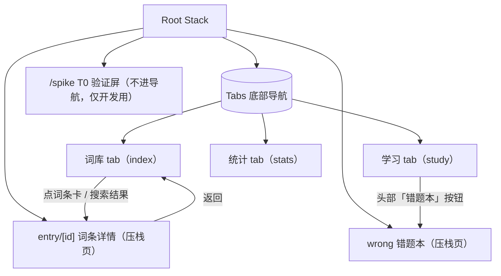
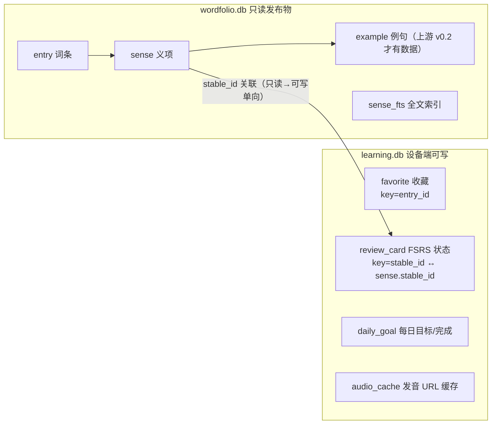

# Wordfolio 移动端功能逻辑树

> 目的：内测反馈「功能间的逻辑不清楚」。本文是全 app 的功能地图——每一屏是什么、
> 数据从哪来到哪去、功能之间如何衔接、未来功能加在哪里。**新功能必须先在 §6 找到槽位再动手。**
> 随代码演进维护；大改在 commit message 里引用本文的章节号。

更新：2026-10-04 ｜ 对应版本：beta.14（练习 + 听音双题型）

## 1. 信息架构（导航树）



- **三个 tab = 三条独立的用户意图**：找词（词库）、学词（学习）、看进展（统计）。
- 词条详情是唯一的压栈页——从词库任何入口（网格卡、搜索结果）进，返回回到原位置。
- spike 屏是 T0 遗留验证页，不出现在任何导航入口，Release 不受影响。

## 2. 三条功能线的职责边界

| 功能线 | 回答的问题 | 包含 | 明确不包含（去哪找） |
|---|---|---|---|
| **词库** | 这个词什么意思？ | 浏览网格、搜索、筛选（全部/收藏/词性）、词条详情、收藏、真人发音 | 学过的词怎么排期（→学习）；学了多少（→统计） |
| **学习** | 今天背什么？ | 今日队列（复习优先、新卡补足）、三种模式：卡片（翻卡+四键评分）/ 练习（四选一）/ 听音（听音辨义）、自动补新卡、词头发音 | 词内容对错（→词库详情核对）；进度趋势（→统计） |
| **统计** | 我学得怎么样？ | 今日进度、连续天数、累计、已稳固、卡片分布、每日目标设置 | 改变调度行为（→学习线 FSRS 参数，M-D 前冻结） |

**衔接点（功能间唯一的合法交互）**：
1. 词库收藏 ⟷ 学习队列：收藏**不会**自动进队列（队列新卡只按词频取），避免用户收藏但从未出现的困惑。
2. 学习评分 ⟷ 统计：评分落 `review_card` + `daily_goal`，统计页只读聚合。
3. 统计改目标 ⟷ 学习队列：次日生效（今日队列不变，见 study.tsx 注释）。

## 3. 数据所有权（两库分离，ADR-0005 D3）



### 3.1 表结构（learning.db，建表语句唯一出处 src/db/study.ts）

| 表 | 键 | 关键列 | 写入方 | 说明 |
|---|---|---|---|---|
| favorite | entry_id | created_at | favorites store | 收藏的是词条级 |
| review_card | stable_id | due/stability/difficulty/reps/lapses/state/last_review | study 屏评分 | 义项级 FSRS 状态，只存最新（无逐次历史） |
| daily_goal | day(YYYY-MM-DD) | target_count/completed_count | 评分、统计页改目标 | 统计页只改 target；completed 由评分推进 |
| audio_cache | word | url/fetched_at | 发音链预取/首播时 | 同词二次播放零联网；URL 失效靠播放失败回退 TTS 自愈 |
| review_log | id 自增（stable_id 索引） | rating(1-4)/due_after/reviewed_at | study 屏每次评分 | **逐次**留痕；review_card 只存最新。错题本与复习曲线的唯一数据源 |

### 3.2 状态管理（zustand）

- `useFavorites`：内存 `Set<entry_id>` 乐观更新 + 异步落库；`hydrate()` 只执行一次（`hydrated` 标记），词库/详情/统计三处共享。
- 学习队列**不进 store**：屏内 useState，评分即落库，离开屏即丢弃（下次进屏重建——FSRS 状态在库里，重建无损）。

## 4. 屏级规格（状态 × 行为矩阵）

每屏一行：进入方式 / 数据读写 / 五态表现。空态文案是产品决策，改前对齐本表。

| 屏 | 进入 | 读 | 写 | loading | empty | error | 特殊 |
|---|---|---|---|---|---|---|---|
| 词库 | 首个 tab | browseEntries / searchSenses / favorite ids | favorite 增删 | 列表 spinner | 「没有词条」/「还没有收藏…」/「没有匹配的义项」 | 顶部红字 + 空列表 | 单字母拒搜给提示；搜索 300ms 防抖；清空按钮 |
| 词条详情 | 词库任意卡 | getEntryDetail / favorite ids | favorite | spinner | 「词条不存在」 | 「无效词条 id」/加载错误 + 返回 | 词头按钮走真人发音链（§5.3）；无例句时例句区整体隐藏 |
| 学习 | tab | getReviewCards / getDailyGoal / getSeedSenseIds / getStudySenses / favorite | 评分写 review_card + daily_goal；首播写 audio_cache | 整屏 spinner | 「今天完成了」/「今天没有到期的任务」（区分 completed>0） | 屏内红字（保留已加载内容） | 同词义项打散；不足目标按词频补新卡 |
| 统计 | tab | getStudyStats / getDailyGoal / favorite ids | setDailyTarget | 屏内 spinner | 数值全 0 正常展示 | 错误框（不再静默转圈） | 改目标次日生效（文案已注明） |

## 5. 关键机制

### 5.1 搜索（词库，`db/search.ts` + `db/repository.ts`）
```
输入 query（300ms 防抖）
├─ 含中文 → LIKE 回退（FTS unicode61 不分词中文）
│    └─ 结果按 rank 分层：词头精确 0 > 词头含 1 > 释义命中 2
└─ 纯拉丁
     ├─ <2 字符 → 拒绝，提示「中文可搜单字」（单字母 FTS 前缀命中 1800+ 条）
     └─ ≥2 字符 → 词头精确/前缀优先（用户找的就是这个词）→ 不足再补 FTS 释义命中
```

### 5.2 今日队列（学习，`study/fsrs-core.ts` + `study/queue.ts`）
```
读 review_card 全表
├─ 过滤 isDue（新卡恒到期；其余按 due ≤ now）
├─ 排序：复习卡（越早到期越前）→ 新卡
├─ 按 stable_id 打散同词头义项（a#1,a#2 连排会掩盖「词认识但义项不认识」）
└─ 截断到 daily_goal.target
补新卡：不足目标时按 e.freq_rank 取尚未建卡的义项（每次 ≤ SEED_BATCH=20）
评分：ts-fsrs v5 next(card, now, grade) → 覆盖写 review_card + 追加 review_log；daily_goal.completed+1
错题本：review_log 按 stable_id 取最新一条，rating=1（重来）且非已稳固 → 答对一次自动移出
复习曲线：review_log 按 reviewed_at 分日聚合，bucketHistory 补零成连续 7 天
```

### 5.3 真人发音链（`utils/pronunciation.ts` → `utils/wordAudio.ts`，**已配韦氏 Learner's key**）
```
点词头喇叭
├─ audio_cache 命中 → 直接播（零联网）
└─ 未命中
     ├─ EXPO_PUBLIC_MW_API_KEY（已配，本地 .env 注入不入库）→ 韦氏 Learner's API
     │    （media.merriam-webster.com，实测无代理网络可达 HTTP 200 ✓）
     ├─ key 缺失/失败 → Free Dictionary API（免 key；其 media 主机无代理网络不可达）
     └─ 都失败 → TTS 兜底（expo-speech，原链路）
播放：expo-audio createAudioPlayer(url) + 轮询 isLoaded，**4.5s 未就绪即销毁并回退 TTS**
（实测：音频 CDN 在无代理网络不可达时 ExoPlayer 永久 BUFFERING——超时兜底必须）
已知限制：无代理的国内网络大概率拿不到真人音频（media 主机不通），静默降级为 TTS；
现状：韦氏链路用户网络实测可达，真人发音默认可用；离线发音包仍作长期项（挂 §6）
注意：EXPO_PUBLIC_ 前缀变量会打进 bundle，是公开变量不是机密；韦氏免费 key 在 dictionaryapi.com 注册
```

### 5.4 FSRS 参数表（`study/fsrs-core.ts`，M-D 内测数据回收前冻结）

| 参数 | 值 | 理由 |
|---|---|---|
| request_retention | 0.9 | 长期学习标准档；M-D 按遗忘曲线实测调 |
| enable_fuzz | false | 内测期可复现、便于对照排查 |
| enable_short_term | true | 保留短时记忆步进，新卡当天内重复出现 |
| 评分四档 | Again/Hard/Good/Easy | ts-fsrs Grade 全集（Manual 不暴露） |
| 「已稳固」口径 | state=Review 且 scheduled_days≥21 | 产品定义（非 FSRS 概念），改动需同步统计页文案 |

## 6. 演进槽位（新功能先对号入座）

| 计划功能 | 槽位 | 触碰的文件 | 依赖 |
|---|---|---|---|
| ~~错题本~~ | **已交付**（/wrong，学习 tab 头部入口） | — | review_log 已就位 |
| ~~复习历史曲线~~ | **已交付**（统计页近 7 日柱状图） | — | review_log 已就位 |
| 复习历史完整曲线（按周/月 + 逐次明细页） | 统计 tab 二级页 | stats.tsx、review_log 查询 | 可在现有柱状图上扩展 |
| ~~每日推送提醒~~ | **已交付**（统计页「每日提醒」卡，expo-notifications 本地通知；无推送服务器，提醒在设备端调度） | utils/reminders.ts、study.ts settings 表、stats.tsx | beta.11；iOS 侧同代码待恢复分发时验证 |
| ~~义项四选一~~ | **已交付**（学习 tab「卡片/练习」模式切换，队列同源；答对=Good、答错=Again 自动计分） | components/QuizCard.tsx、study/quiz-core.ts、repository.getDistractorSenses | beta.13；干扰项同词性优先 |
| ~~听音辨义~~ | **已交付**（QuizCard `variant='listen'`：藏词头 + 自动播放 + 可重播，与四选一共享出题逻辑） | QuizCard.tsx、study.tsx 三模式 | beta.14；有道发音为其前提 |
| 例句挖空 | 练习模式第三题型 | QuizCard 同层加新题型组件 | 等上游例句数据（M2-T08） |
| 词书选择（exam_tag） | 词库 tab 顶部入口 + 学习队列过滤 | repository browse 加维度 | M-D；上游有标注数据后 |
| 离线发音包（词头音频随词库发布） | 上游发布物 entry.audio_am_url + 打包 assets/audio | 上游生成管道加音频下载 | 韦氏/共音源许可核许；彻底摆脱在线依赖 |
| 韦氏 key 配置 | 无需改码：EAS 构建时注入 `EXPO_PUBLIC_MW_API_KEY` | 无（read process.env） | 用户在 dictionaryapi.com 注册 |
| OTA 更新 | 发布层（eas update，channel beta） | eas.json 已预留 channel | beta.3+ 已具备 |

**原则**：每个新功能必须能放进上表某一行；放不进去 = 信息架构要改 = 先改本文评审，再写代码。

## 7. 组件清单（复用层）

| 组件/模块 | 职责 | 被谁用 |
|---|---|---|
| components/icons.tsx | Ionicons 线性图标唯一出口（禁 emoji） | 全部屏 |
| components/FilterChips.tsx | 换行筛选 chips（minHeight 40） | 词库 |
| components/WordCard.tsx | 浏览网格卡（词头+星标+词性+释义预览） | 词库 |
| components/SenseCard.tsx | 义项卡（中英定义+例句+行级点读） | 详情 |
| components/TtsHint.tsx | TTS 不可用提示条（probeVoices 驱动） | 词库/学习/详情 |
| db/search.ts | 检索纯函数（CJK 判定/MATCH/LIKE/长度门槛/分层） | repository；vitest 14 例 |
| db/upgrade.ts | edition bootstrap 决策 | release；vitest 3 例 |
| db/learning-core.ts | 收藏 toggle 纯函数 | favorites store；vitest 5 例 |
| study/fsrs-core.ts | FSRS 调度纯逻辑 | study 屏；vitest 12 例 |
| study/queue.ts | 同词打散 | study 屏；vitest 4 例 |
| study/stats-core.ts | streak 计算 | stats 屏；vitest 7 例 |
| utils/pronunciation.ts | 发音 URL 解析链（MW→free→cache） | wordAudio；待补单测 |

## 8. 设计语义速查

- **色**：琥珀=主行动/选中/已收藏（**明暗主题同色相**，暗色加亮保对比）；蓝=可点文本；绿=完成语义（进度条）；其余中性阶。亮色画布暖中性、暗色画布石板蓝夜色——两主题各自内部同温。见 `src/theme/tokens.ts` 头注。
- **字**：屏标题 26/800；卡标题 15–17/700；正文 13–14；辅助 12 muted。
- **触控**：可点元素最小高 40（chip）/ 44（目标）/ 48（评分、主按钮）。
- **布局红线**：Android 底部导航不写死高度（交安全区）；筛选类横排超过 6 项必须换行不滚动。
